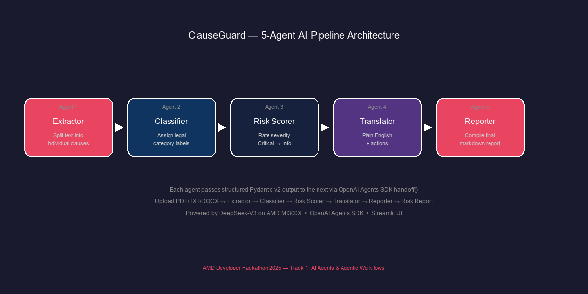

# ClauseGuard — AI-Powered Contract Clause Risk Analyzer

Upload any contract (PDF, TXT, DOCX). ClauseGuard runs it through a 5-agent AI pipeline and outputs a structured risk report classifying every clause by severity with plain-English explanations.

## Architecture



```
  ┌──────────┐    ┌───────────┐    ┌─────────────┐    ┌──────────────┐    ┌──────────┐
  │ Extractor│───▶│Classifier │───▶│ Risk Scorer │───▶│  Translator  │───▶│ Reporter │
  │ (Agent 1)│    │ (Agent 2) │    │  (Agent 3)  │    │  (Agent 4)   │    │ (Agent 5)│
  └──────────┘    └───────────┘    └─────────────┘    └──────────────┘    └──────────┘
       │               │                 │                   │                 │
       ▼               ▼                 ▼                   ▼                 ▼
  Split text      Assign types     Score severity      Plain English     Final markdown
  into clauses    + contract       per clause          + actions         report
                  type
```

Agents communicate via OpenAI Agents SDK `handoff()`, passing structured Pydantic v2 output at each stage. If any agent times out (30s limit) or fails, the pipeline continues with partial data — the Reporter always produces a FinalReport.

## Prerequisites

- Python 3.11+
- [DeepSeek API key](https://platform.deepseek.com/) (OpenAI-compatible endpoint)

## Setup

```bash
# Clone the repository
git clone <repo-url>
cd clauseguard

# Install dependencies
pip install -r requirements.txt

# Configure your API key
cp .env.example .env
# Edit .env and add your DEEPSEEK_API_KEY
```

## Usage

### CLI

```bash
python main.py --file sample_contracts/sample_nda.txt
python main.py --file sample_contracts/sample_nda.txt --output my_report.md
```

### Streamlit UI

```bash
streamlit run app.py
```

Open http://localhost:8501 in your browser, upload a contract, and click Analyze.

### Run Tests

```bash
pytest tests/ -v
```

## Sample Output

```markdown
# ClauseGuard Risk Report
**Contract:** sample_nda.txt
**Type:** NDA
**Overall Risk Score:** 5.0/10

## Top 3 Actions Before Signing
1. Demand a carve-out for inventions created on own time using own equipment
2. Negotiate to limit the non-compete to specific geographic regions
3. Negotiate to add an opt-out clause for arbitration

## Risk Summary
| Severity | Count |
|----------|-------|
| 🔴 Critical | 1 |
| 🟠 High | 2 |
| 🟡 Medium | 1 |
| 🟢 Low | 2 |
| ℹ️ Info | 2 |
```

## AMD Developer Cloud Deployment

ClauseGuard is designed to run on AMD Developer Cloud infrastructure. The DeepSeek API provides the LLM backend, and the application itself is a lightweight Python service suitable for containerized deployment.

### Docker deployment

```dockerfile
FROM python:3.11-slim
WORKDIR /app
COPY requirements.txt .
RUN pip install -r requirements.txt
COPY . .
ENV STREAMLIT_SERVER_PORT=8501
EXPOSE 8501
CMD ["streamlit", "run", "app.py", "--server.address=0.0.0.0"]
```

## License

MIT
